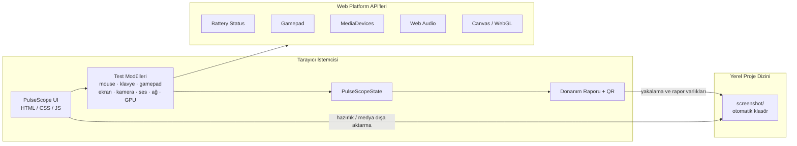
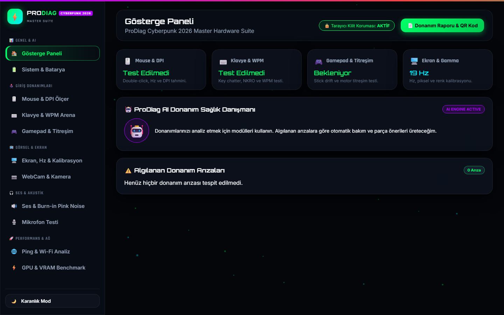
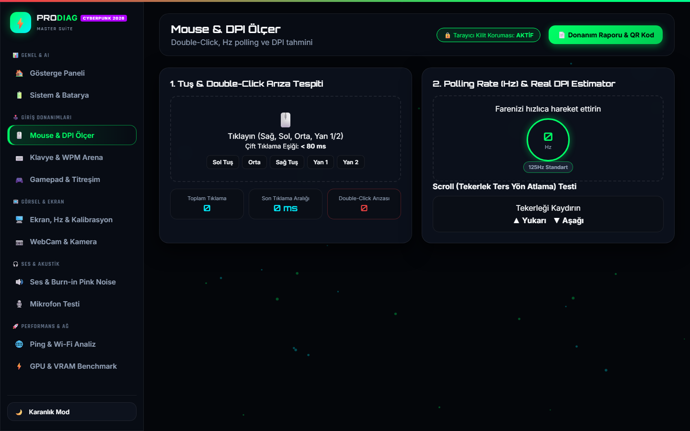
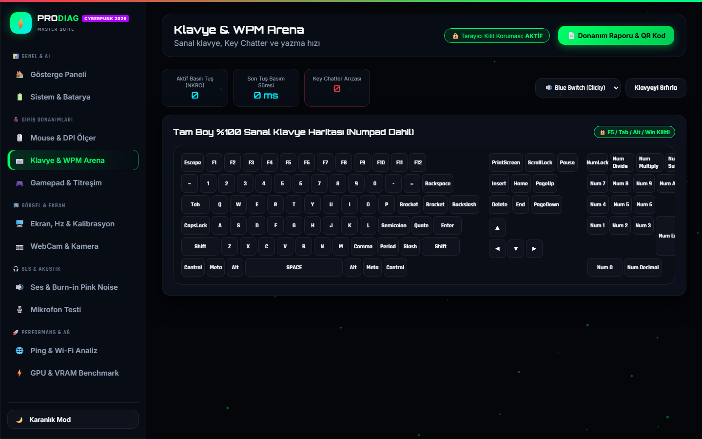

# PulseScope

> 🇬🇧 [Click here for English version](README.md)

<p align="center">
  <em>“Her sinyali gör — her cihazı test et.”</em>
</p>

<p align="center">
  
  
  
</p>

<p align="center">
  
  
  
  
</p>

<p align="center">
  <strong>Tarayıcı tabanlı elektronik cihaz test laboratuvarı — mouse, klavye, gamepad, ekran, kamera, ses, ağ ve GPU.</strong>
</p>

<p align="center">
  <a href="#-proje-hakkında-about-the-project">Hakkında</a> ·
  <a href="#-sistem-mimarisi-system-architecture">Mimari</a> ·
  <a href="#-ekran-görüntüleri-screenshots">Ekran Görüntüleri</a> ·
  <a href="#-öne-çıkan-özellikler-features">Özellikler</a> ·
  <a href="#-dosya-ağacı-folder-structure">Dosya Ağacı</a> ·
  <a href="#-teknoloji-yığını-tech-stack">Tech Stack</a> ·
  <a href="#-kurulum-installation">Kurulum</a> ·
  <a href="#-güvenlik-ve-zafiyet-bildirimi-security--vulnerability-disclosure">Güvenlik</a> ·
  <a href="#-katkıda-bulunma-ve-lisans-contribution--license">Lisans</a>
</p>

---

## 📌 Proje Hakkında (About The Project)

**PulseScope**, [nightsamuraisec](https://github.com/nightsamuraisec) tarafından geliştirilen açık kaynaklı, tarayıcı tabanlı bir **elektronik cihaz laboratuvarıdır**.

Modern bir tarayıcıyı çevre birimi ve donanım kontrol suite’ine çevirir: DPI / tıklama testleri, WPM ve klavye chatter, gamepad drift & titreşim, ekran kalibrasyonu, webcam, hoparlör / mikrofon, ping & Wi-Fi kontrolleri ve GPU / VRAM tarzı benchmark — neon **Device Lab** arayüzünde.

Ağır kurulum yok. Uygulamayı aç, gereken izinleri ver, modülleri çalıştır, donanım raporunu dışa aktar.

> Portföy, atölye, e-spor kurulumları ve hızlı tezgâh kontrolleri için tasarlandı.

---

## 🏗 Sistem Mimarisi (System Architecture)



**Akış:** UI modülleri Web API’lerle konuşur → sonuçlar `PulseScopeState` içinde toplanır → rapor/export yolu medyayı yerel **`screenshot/`** klasörüne yazar (hazırlık / ilk çalıştırmada oluşturulur).

---

## 🖼 Ekran Görüntüleri (Screenshots)

> Önizleme küçük; **tıklayınca tam boy açılır**. Canlı demo: **[nightsamuraisec.github.io/pulsescope](https://nightsamuraisec.github.io/pulsescope/)**

### Gösterge Paneli

<p align="center">
  <a href="screenshot/dashboard.png" title="Büyüt">
    
  </a>
</p>
<p align="center"><sub>🔍 Tıkla büyüt</sub></p>

### Mouse & DPI

<p align="center">
  <a href="screenshot/mouse.png" title="Büyüt">
    
  </a>
</p>
<p align="center"><sub>🔍 Tıkla büyüt</sub></p>

### Klavye & WPM

<p align="center">
  <a href="screenshot/keyboard.png" title="Büyüt">
    
  </a>
</p>
<p align="center"><sub>🔍 Tıkla büyüt</sub></p>

---

## ✨ Öne Çıkan Özellikler (Features)

- 🖱️ **Mouse & DPI** — çift tık, Hz tahmini, DPI yardımcıları  
- ⌨️ **Klavye & WPM Arena** — chatter / NKRO odaklı kontroller  
- 🎮 **Gamepad** — stick drift ve titreşim testleri  
- 🖥️ **Ekran** — Hz, piksel ve kalibrasyon yardımcıları  
- 📷 **Kamera / 🔊 Ses / 🎙️ Mikrofon** — MediaDevices + Web Audio  
- 🌐 **Ağ** — ping ve Wi-Fi odaklı kontroller  
- ⚡ **GPU / VRAM tarzı benchmark** — canvas / WebGL yolu  
- 📄 **Donanım raporu + QR** — dışa aktarılabilir özet  
- 🌙 **Karanlık / aydınlık tema**  

- 📸 **`screenshot/` otomatik medya kasası (öne çıkan)** — Hazırlık / ilk çalıştırmada PulseScope, proje çalışma dizininde **`screenshot/`** klasörünün varlığını garanti eder. Arayüz yakalamaları, dışa aktarılan kareler ve rapor medyası **yerelde** bu klasöre kaydedilir — varsayılan olarak buluta gitmez.

---

## 🗂 Dosya Ağacı (Folder Structure)

```text
pulsescope/
├── index.html
├── style.css
├── js/
│   ├── app.js
│   ├── mouse-test.js
│   ├── keyboard-test.js
│   ├── gamepad-test.js
│   ├── display-test.js
│   ├── camera-test.js
│   ├── audio-test.js
│   ├── network-test.js
│   └── gpu-benchmark.js
├── screenshot/                 # otomatik yerel medya klasörü
│   ├── dashboard.png
│   ├── mouse.png
│   └── keyboard.png
├── tools/
│   └── ensure_screenshot_dir.py
├── LICENSE                     # MIT © nightsamuraisec
├── README.md
└── README-tr.md
```

---

## 🛠 Teknoloji Yığını (Tech Stack)

| Katman | Teknoloji | Amaç |
| --- | --- | --- |
| Arayüz | HTML5 + CSS3 | Device Lab kabuğu, neon cam layout |
| Mantık | Vanilla JavaScript | Modül orkestrasyonu ve `PulseScopeState` |
| Cihaz I/O | Web API’ler | Battery, Gamepad, MediaDevices, Web Audio, Canvas/WebGL |
| Medya klasörü | `screenshot/` + hazırlık script’i | Yerel yakalama / export depolama |
| Dokümantasyon | Markdown (EN + TR) | Portföy hazır doküman |

---

## 🚀 Kurulum (Installation)

### Ön şartlar

| Araç | Not |
| --- | --- |
| Modern Chromium tabanlı tarayıcı | Web API kapsamı daha geniş |
| Python 3.10+ (isteğe bağlı) | `screenshot/` oluşturma script’i |
| Node.js (isteğe bağlı) | Yerel static host için `npx serve` |

### Kurulum adımları

```bash
git clone https://github.com/nightsamuraisec/pulsescope.git
cd pulsescope

# Yerel screenshot kasasını oluştur / doğrula
python tools/ensure_screenshot_dir.py

# Yerelde sun (birini seç)
npx --yes serve .
# veya:  python -m http.server 8080
```

`http://localhost:3000` (veya sunucunun yazdığı port) adresini aç.

### Çevre Değişkenleri

PulseScope statik bir istemci uygulamasıdır — **zorunlu secret yoktur**. İsteğe bağlı şablon:

```env
# .env.example (opsiyonel)
SCREENSHOT_DIR=screenshot
APP_THEME=dark
```

---

## 🔐 Güvenlik ve Zafiyet Bildirimi (Security & Vulnerability Disclosure)

**İzinler**

- Kamera / mikrofon erişimi **tarayıcı iznine** tabidir.  
- Proje medyası için yerel yazma hedefi, çalışma dizinindeki **`screenshot/`** klasörüdür.  
- CSP ve ilgili sertleştirme başlıkları `index.html` içinde tanımlıdır.  
- Test sonuçları oturum içinde kalır (`PulseScopeState`); **varsayılan bulut telemetrisi yoktur**.

**Zafiyet bildirimi**

Güvenlik açığı bulursan (XSS, izin atlama, güvensiz dosya işleme vb.) exploit ayrıntılarıyla **herkese açık issue açma**.

1. **nightsamuraisec** ile özel iletişim kur: [https://github.com/nightsamuraisec](https://github.com/nightsamuraisec)  
2. Etki, yeniden üretim adımları ve mümkünse etkilenen dosyaları ekle.  
3. Kamuya açıklamadan önce makul bir düzeltme süresi tanı.

---

## 🤝 Katkıda Bulunma ve Lisans (Contribution & License)

Katkılar Pull Request ile memnuniyetle karşılanır. Değişiklikleri odaklı tut, secret commit etme, `screenshot/` içine gereksiz binary koyma.

Bu proje **MIT License** ile lisanslanmıştır.

```text
MIT License
Copyright (c) 2026 nightsamuraisec
```

Tam metin: [`LICENSE`](LICENSE). PulseScope adı ve bu kod tabanına ilişkin haklar, MIT License’ın izin verdiği ölçüde **nightsamuraisec**e aittir.

---

<p align="center">
  <sub>PulseScope · Device Lab · <a href="https://github.com/nightsamuraisec">nightsamuraisec</a> · MIT</sub>
</p>
