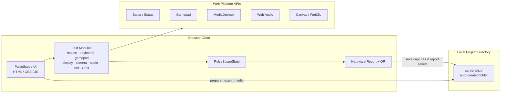

# PulseScope

> 🇹🇷 [Türkçe sürüm için tıklayın](README-tr.md)

<p align="center">
  <em>“See every signal — test every device.”</em>
</p>

<p align="center">
  
  
  
</p>

<p align="center">
  
  
  
  
</p>

<p align="center">
  <strong>Browser-based electronics device test lab — mouse, keyboard, gamepad, display, camera, audio, network & GPU.</strong>
</p>

<p align="center">
  <a href="#-about-the-project">About</a> ·
  <a href="#-system-architecture">Architecture</a> ·
  <a href="#-screenshots">Screenshots</a> ·
  <a href="#-features">Features</a> ·
  <a href="#-folder-structure">Structure</a> ·
  <a href="#-tech-stack">Tech Stack</a> ·
  <a href="#-installation">Install</a> ·
  <a href="#-security--vulnerability-disclosure">Security</a> ·
  <a href="#-contribution--license">License</a>
</p>

---

## 📌 About The Project

**PulseScope** is an open-source, browser-based **electronics device laboratory** by [nightsamuraisec](https://github.com/nightsamuraisec).

It turns a modern browser into a full peripheral & hardware check suite: DPI / click tests, WPM & keyboard chatter, gamepad drift & rumble, display calibration, webcam, speakers / mic, ping & Wi-Fi checks, and a GPU / VRAM style benchmark — wrapped in a neon **Device Lab** UI.

No heavy installers. Open the app, grant the permissions you need, run modules, export a hardware report.

> Built for portfolio, workshops, e-sports setups, and quick bench checks.

---

## 🏗 System Architecture



**Flow:** UI modules talk to Web APIs → results land in `PulseScopeState` → report/export path writes media into the local **`screenshot/`** directory (created on prepare/first run).

---

## 🖼 Screenshots

> Preview is compact; **click to open full size**. Live demo: **[nightsamuraisec.github.io/pulsescope](https://nightsamuraisec.github.io/pulsescope/)**

### Dashboard

<p align="center">
  <a href="screenshot/dashboard.png" title="Enlarge">
    
  </a>
</p>
<p align="center"><sub>🔍 Click to enlarge</sub></p>

### Mouse & DPI

<p align="center">
  <a href="screenshot/mouse.png" title="Enlarge">
    
  </a>
</p>
<p align="center"><sub>🔍 Click to enlarge</sub></p>

### Keyboard & WPM

<p align="center">
  <a href="screenshot/keyboard.png" title="Enlarge">
    
  </a>
</p>
<p align="center"><sub>🔍 Click to enlarge</sub></p>

---

## ✨ Features

- 🖱️ **Mouse & DPI** — double-click, Hz estimate, DPI helpers  
- ⌨️ **Keyboard & WPM Arena** — chatter / NKRO oriented checks  
- 🎮 **Gamepad** — stick drift & vibration tests  
- 🖥️ **Display** — Hz, pixel & calibration helpers  
- 📷 **Camera / 🔊 Audio / 🎙️ Mic** — MediaDevices + Web Audio  
- 🌐 **Network** — ping & Wi-Fi oriented checks  
- ⚡ **GPU / VRAM style benchmark** — canvas / WebGL path  
- 📄 **Hardware report + QR** — exportable summary  
- 🌙 **Dark / light theme** toggle  

- 📸 **`screenshot/` auto media vault (highlight)** — On prepare / first run, PulseScope ensures a **`screenshot/`** folder exists in the project working directory. UI captures, exported frames, and report-related media are stored **locally** in that folder — organized on disk, no cloud upload by default.

---

## 🗂 Folder Structure

```text
pulsescope/
├── index.html
├── style.css
├── js/
│   ├── app.js
│   ├── mouse-test.js
│   ├── keyboard-test.js
│   ├── gamepad-test.js
│   ├── display-test.js
│   ├── camera-test.js
│   ├── audio-test.js
│   ├── network-test.js
│   └── gpu-benchmark.js
├── screenshot/                 # auto-created local media folder
│   ├── dashboard.png
│   ├── mouse.png
│   └── keyboard.png
├── tools/
│   └── ensure_screenshot_dir.py
├── LICENSE                     # MIT © nightsamuraisec
├── README.md
└── README-tr.md
```

---

## 🛠 Tech Stack

| Layer | Technology | Purpose |
| --- | --- | --- |
| UI | HTML5 + CSS3 | Device Lab shell, neon glass layout |
| Logic | Vanilla JavaScript | Module orchestration & `PulseScopeState` |
| Device I/O | Web APIs | Battery, Gamepad, MediaDevices, Web Audio, Canvas/WebGL |
| Media folder | `screenshot/` + prepare script | Local capture / export storage |
| Docs | Markdown (EN + TR) | Portfolio-ready documentation |

---

## 🚀 Installation

### Prerequisites

| Tool | Notes |
| --- | --- |
| Modern Chromium-based browser | Best Web API coverage |
| Python 3.10+ (optional) | Creates `screenshot/` via prepare script |
| Node.js (optional) | `npx serve` for local static hosting |

### Setup

```bash
git clone https://github.com/nightsamuraisec/pulsescope.git
cd pulsescope

# Create / verify local screenshot vault
python tools/ensure_screenshot_dir.py

# Serve locally (pick one)
npx --yes serve .
# or:  python -m http.server 8080
```

Open `http://localhost:3000` (or the port printed by your server).

### Environment Variables

PulseScope is a static client app — **no required secrets**. Optional template:

```env
# .env.example (optional)
SCREENSHOT_DIR=screenshot
APP_THEME=dark
```

---

## 🔐 Security & Vulnerability Disclosure

**Permissions**

- Camera / microphone access is **browser-gated** (user consent).  
- Local write target for project media is the **`screenshot/`** folder in the repo working directory (prepare script / export workflow).  
- Content Security Policy (CSP) and related hardening headers are declared in `index.html`.  
- Test results stay in-session (`PulseScopeState`); there is **no default cloud telemetry**.

**Reporting a vulnerability**

If you discover a security issue (XSS, permission bypass, unsafe file handling, etc.), please **do not** open a public issue with exploit details.

1. Contact **nightsamuraisec** privately via GitHub: [https://github.com/nightsamuraisec](https://github.com/nightsamuraisec)  
2. Include impact, steps to reproduce, and affected files if possible.  
3. Allow reasonable time for a fix before public disclosure.

---

## 🤝 Contribution & License

Contributions are welcome via Pull Requests. Keep changes focused, avoid committing secrets, and do not commit unnecessary binaries into `screenshot/`.

This project is licensed under the **MIT License**.

```text
MIT License
Copyright (c) 2026 nightsamuraisec
```

See [`LICENSE`](LICENSE) for the full text. All rights to the PulseScope name and this codebase, to the extent permitted by the MIT License, are attributed to **nightsamuraisec**.

---

<p align="center">
  <sub>PulseScope · Device Lab · by <a href="https://github.com/nightsamuraisec">nightsamuraisec</a> · MIT</sub>
</p>
